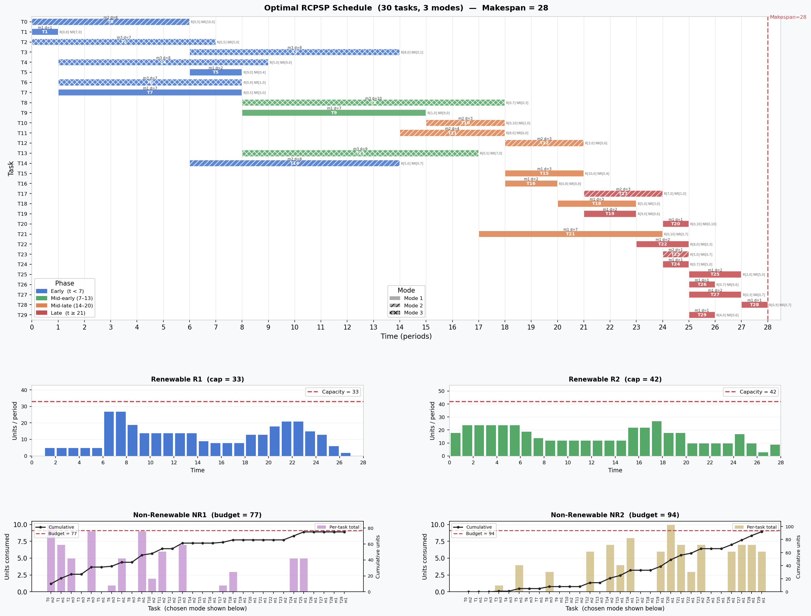

# CPLEX Benchmark - MRCPSP {.unnumbered}

## Motivation
We execute a multi-mode RCPSP benchmark from [PSP-LIB](https://www.om-db.wi.tum.de/psplib/) to evaluate performance of the optimal scheduling in the CDT.

## Input Data
The benchmark data has 30 jobs, 2 renewable resources, 2 non-renewable resources and 3 modes. See `CDT2025/codes/cplex-mmrcpsp`.

```
// --------------------------------------------------------------------------
// Licensed Materials - Property of IBM
//
// 5725-A06 5725-A29 5724-Y48 5724-Y49 5724-Y54 5724-Y55
// Copyright IBM Corporation 1998, 2024. All Rights Reserved.
//
// Note to U.S. Government Users Restricted Rights:
// Use, duplication or disclosure restricted by GSA ADP Schedule
// Contract with IBM Corp.
// --------------------------------------------------------------------------

NbTasks = 30;
NbRenewableRsrcs    = 2;
NbNonRenewableRsrcs = 2;

CapRenewableRsrc = [ 33, 42 ]; 

CapNonRenewableRsrc = [ 77, 94 ]; 

Tasks = {
  < 0, { 3, 5, 14 } >,
  < 1, { 4, 6, 7 } >,
  < 2, { 8, 13 } >,
  < 3, { 11, 29 } >,
  < 4, { 17 } >,
  < 5, { 9, 11, 21 } >,
  < 6, { 10, 13 } >,
  < 7, { 8, 9, 23 } >,
  < 8, { 25 } >,
  < 9, { 10, 15, 24 } >,
  < 10, { 16, 20 } >,
  < 11, { 12, 15, 16 } >,
  < 12, { 17 } >,
  < 13, { 15, 16, 21 } >,
  < 14, { 27 } >,
  < 15, { 19 } >,
  < 16, { 18, 26 } >,
  < 17, { 20 } >,
  < 18, { 22 } >,
  < 19, { 20, 22 } >,
  < 20, { 26, 27 } >,
  < 21, { 23, 24, 25 } >,
  < 22, { 25 } >,
  < 23, { 27, 28, 29 } >,
  < 24, { 26 } >,
  < 25, { 28 } >,
  < 26, { 28 } >,
  < 27, {  } >,
  < 28, {  } >,
  < 29, {  } >
 }; 

Modes = {
  < 0, 1, 6, [ 1, 0 ], [ 10, 0 ] >,
  < 0, 2, 6, [ 0, 5 ], [ 10, 0 ] >,
  < 0, 3, 7, [ 0, 4 ], [ 0, 2 ] >,
  < 1, 1, 1, [ 0, 8 ], [ 7, 0 ] >,
  < 1, 2, 4, [ 0, 6 ], [ 6, 0 ] >,
  < 1, 3, 8, [ 9, 0 ], [ 0, 9 ] >,
  < 2, 1, 4, [ 0, 6 ], [ 0, 9 ] >,
  < 2, 2, 6, [ 1, 0 ], [ 0, 8 ] >,
  < 2, 3, 7, [ 0, 5 ], [ 5, 0 ] >,
  < 3, 1, 2, [ 0, 7 ], [ 0, 6 ] >,
  < 3, 2, 3, [ 0, 6 ], [ 0, 4 ] >,
  < 3, 3, 8, [ 8, 0 ], [ 0, 1 ] >,
  < 4, 1, 3, [ 8, 0 ], [ 0, 7 ] >,
  < 4, 2, 8, [ 7, 0 ], [ 0, 7 ] >,
  < 4, 3, 8, [ 5, 0 ], [ 9, 0 ] >,
  < 5, 1, 2, [ 9, 0 ], [ 0, 4 ] >,
  < 5, 2, 3, [ 0, 6 ], [ 3, 0 ] >,
  < 5, 3, 4, [ 4, 0 ], [ 0, 3 ] >,
  < 6, 1, 3, [ 0, 9 ], [ 0, 8 ] >,
  < 6, 2, 7, [ 6, 0 ], [ 10, 0 ] >,
  < 6, 3, 7, [ 0, 9 ], [ 1, 0 ] >,
  < 7, 1, 7, [ 0, 5 ], [ 5, 0 ] >,
  < 7, 2, 10, [ 5, 0 ], [ 0, 2 ] >,
  < 7, 3, 10, [ 0, 5 ], [ 0, 4 ] >,
  < 8, 1, 3, [ 8, 0 ], [ 7, 0 ] >,
  < 8, 2, 6, [ 0, 8 ], [ 7, 0 ] >,
  < 8, 3, 10, [ 0, 7 ], [ 0, 3 ] >,
  < 9, 1, 7, [ 1, 0 ], [ 9, 0 ] >,
  < 9, 2, 7, [ 0, 8 ], [ 7, 0 ] >,
  < 9, 3, 8, [ 0, 7 ], [ 0, 10 ] >,
  < 10, 1, 3, [ 9, 0 ], [ 0, 4 ] >,
  < 10, 2, 3, [ 0, 10 ], [ 2, 0 ] >,
  < 10, 3, 10, [ 0, 9 ], [ 2, 0 ] >,
  < 11, 1, 1, [ 0, 7 ], [ 6, 0 ] >,
  < 11, 2, 4, [ 8, 0 ], [ 6, 0 ] >,
  < 11, 3, 8, [ 0, 4 ], [ 0, 5 ] >,
  < 12, 1, 2, [ 7, 0 ], [ 0, 6 ] >,
  < 12, 2, 3, [ 3, 0 ], [ 0, 6 ] >,
  < 12, 3, 8, [ 0, 8 ], [ 7, 0 ] >,
  < 13, 1, 4, [ 9, 0 ], [ 9, 0 ] >,
  < 13, 2, 6, [ 0, 9 ], [ 0, 6 ] >,
  < 13, 3, 9, [ 0, 5 ], [ 7, 0 ] >,
  < 14, 1, 5, [ 6, 0 ], [ 7, 0 ] >,
  < 14, 2, 8, [ 5, 0 ], [ 0, 7 ] >,
  < 14, 3, 8, [ 0, 8 ], [ 0, 8 ] >,
  < 15, 1, 3, [ 10, 0 ], [ 0, 4 ] >,
  < 15, 2, 5, [ 0, 4 ], [ 0, 4 ] >,
  < 15, 3, 6, [ 7, 0 ], [ 0, 2 ] >,
  < 16, 1, 2, [ 0, 8 ], [ 0, 8 ] >,
  < 16, 2, 6, [ 0, 7 ], [ 8, 0 ] >,
  < 16, 3, 7, [ 0, 7 ], [ 0, 6 ] >,
  < 17, 1, 2, [ 0, 4 ], [ 0, 5 ] >,
  < 17, 2, 3, [ 7, 0 ], [ 1, 0 ] >,
  < 17, 3, 4, [ 6, 0 ], [ 0, 5 ] >,
  < 18, 1, 3, [ 5, 0 ], [ 3, 0 ] >,
  < 18, 2, 10, [ 0, 6 ], [ 0, 4 ] >,
  < 18, 3, 10, [ 3, 0 ], [ 3, 0 ] >,
  < 19, 1, 2, [ 9, 0 ], [ 0, 6 ] >,
  < 19, 2, 8, [ 0, 9 ], [ 4, 0 ] >,
  < 19, 3, 8, [ 0, 9 ], [ 0, 4 ] >,
  < 20, 1, 1, [ 0, 10 ], [ 0, 10 ] >,
  < 20, 2, 3, [ 0, 6 ], [ 0, 9 ] >,
  < 20, 3, 5, [ 0, 3 ], [ 3, 0 ] >,
  < 21, 1, 7, [ 0, 10 ], [ 0, 7 ] >,
  < 21, 2, 7, [ 0, 9 ], [ 4, 0 ] >,
  < 21, 3, 7, [ 7, 0 ], [ 4, 0 ] >,
  < 22, 1, 2, [ 8, 0 ], [ 0, 3 ] >,
  < 22, 2, 3, [ 2, 0 ], [ 5, 0 ] >,
  < 22, 3, 7, [ 0, 1 ], [ 3, 0 ] >,
  < 23, 1, 1, [ 0, 7 ], [ 5, 0 ] >,
  < 23, 2, 1, [ 5, 0 ], [ 0, 7 ] >,
  < 23, 3, 3, [ 4, 0 ], [ 0, 7 ] >,
  < 24, 1, 1, [ 0, 7 ], [ 5, 0 ] >,
  < 24, 2, 10, [ 5, 0 ], [ 3, 0 ] >,
  < 24, 3, 10, [ 0, 7 ], [ 4, 0 ] >,
  < 25, 1, 2, [ 2, 0 ], [ 5, 0 ] >,
  < 25, 2, 3, [ 0, 9 ], [ 0, 5 ] >,
  < 25, 3, 9, [ 0, 4 ], [ 3, 0 ] >,
  < 26, 1, 1, [ 0, 7 ], [ 0, 6 ] >,
  < 26, 2, 4, [ 0, 3 ], [ 0, 6 ] >,
  < 26, 3, 8, [ 4, 0 ], [ 0, 3 ] >,
  < 27, 1, 2, [ 0, 3 ], [ 0, 7 ] >,
  < 27, 2, 10, [ 2, 0 ], [ 0, 7 ] >,
  < 27, 3, 10, [ 0, 3 ], [ 0, 6 ] >,
  < 28, 1, 1, [ 0, 9 ], [ 0, 7 ] >,
  < 28, 2, 6, [ 6, 0 ], [ 5, 0 ] >,
  < 28, 3, 10, [ 4, 0 ], [ 0, 5 ] >,
  < 29, 1, 1, [ 4, 0 ], [ 0, 6 ] >,
  < 29, 2, 1, [ 3, 0 ], [ 7, 0 ] >,
  < 29, 3, 10, [ 0, 5 ], [ 5, 0 ] >
 }; 

```

## DAG

The DAG is shown below.


## CPLEX Code and Results

The CPLEX code for solving this multi-mode, resource-constrained scheduling problem is as follows.

```
// --------------------------------------------------------------------------
// Licensed Materials - Property of IBM
//
// 5725-A06 5725-A29 5724-Y48 5724-Y49 5724-Y54 5724-Y55
// Copyright IBM Corporation 1998, 2024. All Rights Reserved.
//
// Note to U.S. Government Users Restricted Rights:
// Use, duplication or disclosure restricted by GSA ADP Schedule
// Contract with IBM Corp.
// --------------------------------------------------------------------------

using CP;

int NbTasks = ...;
int NbRenewableRsrcs    = ...;
int NbNonRenewableRsrcs = ...;

range RenewableRsrcIds    = 0..NbRenewableRsrcs-1; 
range NonRenewableRsrcIds = 0..NbNonRenewableRsrcs-1; 

int CapRenewableRsrc    [RenewableRsrcIds] = ...;
int CapNonRenewableRsrc [NonRenewableRsrcIds] = ...;

tuple Task {
  key int id;
  {int}   succs; 
}
{Task} Tasks = ...;

tuple Mode {
  key int taskId;
  key int id;
  int pt;
  int dmdRenewable   [RenewableRsrcIds];
  int dmdNonRenewable[NonRenewableRsrcIds];
}
{Mode} Modes = ...;

dvar interval task[t in Tasks];
dvar interval mode[m in Modes] optional  size m.pt;

cumulFunction renewableRsrcUsage[r in RenewableRsrcIds] = 
  sum (m in Modes: m.dmdRenewable[r]>0) pulse(mode[m], m.dmdRenewable[r]);

dexpr int nonRenewableRsrcUsage[r in NonRenewableRsrcIds] = 
  sum (m in Modes: m.dmdNonRenewable[r]>0) m.dmdNonRenewable[r] * presenceOf(mode[m]);

execute {
		cp.param.FailLimit = 10000;
}

minimize max(t in Tasks) endOf(task[t]);
subject to {
  forall (t in Tasks) 
    alternative(task[t], all(m in Modes: m.taskId==t.id) mode[m]);
  forall (r in RenewableRsrcIds)
    renewableRsrcUsage[r] <= CapRenewableRsrc[r];
  forall (r in NonRenewableRsrcIds)
    nonRenewableRsrcUsage[r] <= CapNonRenewableRsrc[r];    
  forall (t1 in Tasks, t2id in t1.succs)
    endBeforeStart(task[t1], task[<t2id>]);
}

execute {
  for (var m in Modes) {
    if (mode[m].present)
      writeln("Task " + m.taskId + " with mode " + m.id + " starting at " + mode[m].start);
  }
}

```

This gives the output:

```
// solution with objective 28
Task 0 with mode 2 starting at 0
Task 1 with mode 1 starting at 0
Task 2 with mode 3 starting at 0
Task 3 with mode 3 starting at 6
Task 4 with mode 3 starting at 1
Task 5 with mode 1 starting at 6
Task 6 with mode 3 starting at 1
Task 7 with mode 1 starting at 1
Task 8 with mode 3 starting at 8
Task 9 with mode 1 starting at 8
Task 10 with mode 2 starting at 15
Task 11 with mode 2 starting at 14
Task 12 with mode 2 starting at 18
Task 13 with mode 3 starting at 8
Task 14 with mode 2 starting at 6
Task 15 with mode 1 starting at 18
Task 16 with mode 1 starting at 18
Task 17 with mode 2 starting at 21
Task 18 with mode 1 starting at 20
Task 19 with mode 1 starting at 21
Task 20 with mode 1 starting at 24
Task 21 with mode 1 starting at 17
Task 22 with mode 1 starting at 23
Task 23 with mode 2 starting at 24
Task 24 with mode 1 starting at 24
Task 25 with mode 1 starting at 25
Task 26 with mode 1 starting at 25
Task 27 with mode 1 starting at 25
Task 28 with mode 1 starting at 27
Task 29 with mode 1 starting at 25
```

The following output log is produced.

```
 ! --------------------------------------------------- CP Optimizer 22.1.2.0 --
 ! Minimization problem - 120 variables, 90 constraints
 ! FailLimit            = 10000
 ! Initial process time : 0.00s (0.00s extraction + 0.00s propagation)
 !  . Log search space  : 267.1 (before), 267.1 (after)
 !  . Memory usage      : 897.2 kB (before), 897.2 kB (after)
 ! Using parallel search with 8 workers.
 ! ----------------------------------------------------------------------------
 !          Best Branches  Non-fixed    W       Branch decision
                        0        120                 -
 + New bound is 28
 ! Using iterative diving.
 *            43       76  0.08s        1      (gap is 34.88%)
 *            42      209  0.08s        1      (gap is 33.33%)
 *            39      545  0.08s        1      (gap is 28.21%)
 *            38      569  0.08s        1      (gap is 26.32%)
 *            37      592  0.08s        1      (gap is 24.32%)
 *            36      717  0.08s        1      (gap is 22.22%)
              36     1000          2    1         0  = startOf(mode({2,3}))
 *            28     1037  0.08s        1      (gap is 0.00%)
 ! ----------------------------------------------------------------------------
 ! Search completed, 7 solutions found.
 ! Best objective         : 28 (optimal - effective tol. is 0)
 ! Best bound             : 28
 ! ----------------------------------------------------------------------------
 ! Number of branches     : 28941
 ! Number of fails        : 1956
 ! Total memory usage     : 7.7 MB (7.1 MB CP Optimizer + 0.6 MB Concert)
 ! Time spent in solve    : 0.09s (0.09s engine + 0.00s extraction)
 ! Search speed (br. / s) : 321567.0
 ! ----------------------------------------------------------------------------

```

## Results - Output

The following python script takes the CPLEX output and produces nice graphics.

```python
import matplotlib.pyplot as plt
import matplotlib.patches as mpatches
import matplotlib.gridspec as gridspec
import numpy as np

# ─────────────────────────────────────────────────────────────────────────────
#  Full mode table parsed from CPLEX .dat
#  modes_data[task][mode] = (duration, R1, R2, NR1, NR2)
# ─────────────────────────────────────────────────────────────────────────────
modes_data = {
    0:  {1:(6,1,0,10,0), 2:(6,0,5,10,0), 3:(7,0,4,0,2)},
    1:  {1:(1,0,8,7,0),  2:(4,0,6,6,0),  3:(8,9,0,0,9)},
    2:  {1:(4,0,6,0,9),  2:(6,1,0,0,8),  3:(7,0,5,5,0)},
    3:  {1:(2,0,7,0,6),  2:(3,0,6,0,4),  3:(8,8,0,0,1)},
    4:  {1:(3,8,0,0,7),  2:(8,7,0,0,7),  3:(8,5,0,9,0)},
    5:  {1:(2,9,0,0,4),  2:(3,0,6,3,0),  3:(4,4,0,0,3)},
    6:  {1:(3,0,9,0,8),  2:(7,6,0,10,0), 3:(7,0,9,1,0)},
    7:  {1:(7,0,5,5,0),  2:(10,5,0,0,2), 3:(10,0,5,0,4)},
    8:  {1:(3,8,0,7,0),  2:(6,0,8,7,0),  3:(10,0,7,0,3)},
    9:  {1:(7,1,0,9,0),  2:(7,0,8,7,0),  3:(8,0,7,0,10)},
    10: {1:(3,9,0,0,4),  2:(3,0,10,2,0), 3:(10,0,9,2,0)},
    11: {1:(1,0,7,6,0),  2:(4,8,0,6,0),  3:(8,0,4,0,5)},
    12: {1:(2,7,0,0,6),  2:(3,3,0,0,6),  3:(8,0,8,7,0)},
    13: {1:(4,9,0,9,0),  2:(6,0,9,0,6),  3:(9,0,5,7,0)},
    14: {1:(5,6,0,7,0),  2:(8,5,0,0,7),  3:(8,0,8,0,8)},
    15: {1:(3,10,0,0,4), 2:(5,0,4,0,4),  3:(6,7,0,0,2)},
    16: {1:(2,0,8,0,8),  2:(6,0,7,8,0),  3:(7,0,7,0,6)},
    17: {1:(2,0,4,0,5),  2:(3,7,0,1,0),  3:(4,6,0,0,5)},
    18: {1:(3,5,0,3,0),  2:(10,0,6,0,4), 3:(10,3,0,3,0)},
    19: {1:(2,9,0,0,6),  2:(8,0,9,4,0),  3:(8,0,9,0,4)},
    20: {1:(1,0,10,0,10),2:(3,0,6,0,9),  3:(5,0,3,3,0)},
    21: {1:(7,0,10,0,7), 2:(7,0,9,4,0),  3:(7,7,0,4,0)},
    22: {1:(2,8,0,0,3),  2:(3,2,0,5,0),  3:(7,0,1,3,0)},
    23: {1:(1,0,7,5,0),  2:(1,5,0,0,7),  3:(3,4,0,0,7)},
    24: {1:(1,0,7,5,0),  2:(10,5,0,3,0), 3:(10,0,7,4,0)},
    25: {1:(2,2,0,5,0),  2:(3,0,9,0,5),  3:(9,0,4,3,0)},
    26: {1:(1,0,7,0,6),  2:(4,0,3,0,6),  3:(8,4,0,0,3)},
    27: {1:(2,0,3,0,7),  2:(10,2,0,0,7), 3:(10,0,3,0,6)},
    28: {1:(1,0,9,0,7),  2:(6,6,0,5,0),  3:(10,4,0,0,5)},
    29: {1:(1,4,0,0,6),  2:(1,3,0,7,0),  3:(10,0,5,5,0)},
}

# Optimal solution: (task_id, chosen_mode, start)
solution = [
    (0,2,0),(1,1,0),(2,3,0),(3,3,6),(4,3,1),
    (5,1,6),(6,3,1),(7,1,1),(8,3,8),(9,1,8),
    (10,2,15),(11,2,14),(12,2,18),(13,3,8),(14,2,6),
    (15,1,18),(16,1,18),(17,2,21),(18,1,20),(19,1,21),
    (20,1,24),(21,1,17),(22,1,23),(23,2,24),(24,1,24),
    (25,1,25),(26,1,25),(27,1,25),(28,1,27),(29,1,25),
]

# Enrich: (tid, mode, start, end, dur, R1, R2, NR1, NR2)
tasks = []
for tid, m, s in solution:
    dur, R1, R2, NR1, NR2 = modes_data[tid][m]
    tasks.append((tid, m, s, s+dur, dur, R1, R2, NR1, NR2))

MAKESPAN = max(t[3] for t in tasks)
N_TASKS  = len(tasks)
CAP_R    = [33, 42]
BUD_NR   = [77, 94]

# Renewable usage per time period
usage_r1 = np.zeros(MAKESPAN)
usage_r2 = np.zeros(MAKESPAN)
for tid, m, s, e, dur, R1, R2, NR1, NR2 in tasks:
    for t in range(s, e):
        usage_r1[t] += R1
        usage_r2[t] += R2

# Non-renewable totals per task
nr1_per_task = [NR1 for _,_,_,_,_,_,_,NR1,_ in tasks]
nr2_per_task = [NR2 for _,_,_,_,_,_,_,_,NR2 in tasks]
cum_nr1 = np.cumsum(nr1_per_task)
cum_nr2 = np.cumsum(nr2_per_task)

print(f"Makespan      : {MAKESPAN}")
print(f"Max R1 usage  : {usage_r1.max():.0f}  (cap {CAP_R[0]})")
print(f"Max R2 usage  : {usage_r2.max():.0f}  (cap {CAP_R[1]})")
print(f"Total NR1     : {cum_nr1[-1]:.0f}  (budget {BUD_NR[0]})")
print(f"Total NR2     : {cum_nr2[-1]:.0f}  (budget {BUD_NR[1]})")

# ─────────────────────────────────────────────────────────────────────────────
#  Colours & styling
# ─────────────────────────────────────────────────────────────────────────────
def phase_colour(start):
    if start <  7: return '#4878CF'
    if start < 14: return '#55A868'
    if start < 21: return '#DD8452'
    return '#C44E52'

mode_hatch = {1:'', 2:'///', 3:'xxx'}
mode_label = {1:'Mode 1 (solid)', 2:'Mode 2 (///)', 3:'Mode 3 (xxx)'}

# ─────────────────────────────────────────────────────────────────────────────
#  Figure layout
# ─────────────────────────────────────────────────────────────────────────────
fig = plt.figure(figsize=(18, 14))
fig.patch.set_facecolor('#F8F9FA')

gs = gridspec.GridSpec(3, 2, figure=fig,
                       height_ratios=[6, 1.4, 1.4],
                       hspace=0.44, wspace=0.26,
                       left=0.07, right=0.97, top=0.94, bottom=0.05)

ax_gantt = fig.add_subplot(gs[0, :])
ax_r1    = fig.add_subplot(gs[1, 0])
ax_r2    = fig.add_subplot(gs[1, 1])
ax_nr1   = fig.add_subplot(gs[2, 0])
ax_nr2   = fig.add_subplot(gs[2, 1])

for ax in [ax_gantt, ax_r1, ax_r2, ax_nr1, ax_nr2]:
    ax.set_facecolor('#FFFFFF')
    for sp in ax.spines.values():
        sp.set_edgecolor('#CCCCCC')

# ─── Gantt ────────────────────────────────────────────────────────────────────
ax_gantt.set_xlim(0, MAKESPAN + 0.5)
ax_gantt.set_ylim(-0.5, N_TASKS - 0.5)
ax_gantt.set_xlabel('Time (periods)', fontsize=11)
ax_gantt.set_ylabel('Task', fontsize=11)
ax_gantt.set_title(
    f'Optimal RCPSP Schedule  (30 tasks, 3 modes)  —  Makespan = {MAKESPAN}',
    fontsize=12, fontweight='bold', pad=10)
ax_gantt.set_yticks(range(N_TASKS))
ax_gantt.set_yticklabels([f'T{i}' for i in range(N_TASKS)], fontsize=8)
ax_gantt.set_xticks(range(0, MAKESPAN + 1))
ax_gantt.grid(axis='x', color='#E0E0E0', linewidth=0.6, zorder=0)
ax_gantt.invert_yaxis()

for tid, m, s, e, dur, R1, R2, NR1, NR2 in tasks:
    col = phase_colour(s)
    ax_gantt.barh(tid, dur, left=s, height=0.65,
                  color=col, edgecolor='white', linewidth=0.9,
                  hatch=mode_hatch[m], alpha=0.88, zorder=3)
    cx = s + dur / 2
    ax_gantt.text(cx, tid,        f'T{tid}',
                  ha='center', va='center',
                  fontsize=7, fontweight='bold', color='white', zorder=5)
    ax_gantt.text(cx, tid - 0.41, f'm{m} d={dur}',
                  ha='center', va='center',
                  fontsize=5.5, color='#333333', zorder=5)
    # tiny resource annotation at right edge of bar
    res_str = f'R[{R1},{R2}] NR[{NR1},{NR2}]'
    ax_gantt.text(e + 0.05, tid, res_str,
                  ha='left', va='center',
                  fontsize=4.8, color='#666666', zorder=5)

ax_gantt.axvline(MAKESPAN, color='#C44E52', lw=1.8, linestyle='--', alpha=0.85)
ax_gantt.text(MAKESPAN + 0.08, -0.3, f'Makespan={MAKESPAN}',
              color='#C44E52', fontsize=8)

# Combined legend: phase colours + mode hatches
phase_patches = [
    mpatches.Patch(color='#4878CF', label='Early  (t < 7)'),
    mpatches.Patch(color='#55A868', label='Mid-early (7–13)'),
    mpatches.Patch(color='#DD8452', label='Mid-late (14–20)'),
    mpatches.Patch(color='#C44E52', label='Late  (t ≥ 21)'),
]
mode_patches = [
    mpatches.Patch(facecolor='#AAAAAA', hatch='',    label='Mode 1'),
    mpatches.Patch(facecolor='#AAAAAA', hatch='///', label='Mode 2'),
    mpatches.Patch(facecolor='#AAAAAA', hatch='xxx', label='Mode 3'),
]
leg1 = ax_gantt.legend(handles=phase_patches, loc='lower left',
                       fontsize=8, framealpha=0.9, title='Phase')
ax_gantt.legend(handles=mode_patches, loc='lower center',
                fontsize=8, framealpha=0.9, title='Mode')
ax_gantt.add_artist(leg1)

# ─── Renewable bar charts ──────────────────────────────────────────────────
def ren_bar(ax, usage, cap, label, col):
    for i, u in enumerate(usage):
        c = '#E03030' if u > cap else col
        ax.bar(i+0.5, u, width=0.85, color=c,
               edgecolor='white', linewidth=0.5, zorder=3)
    ax.axhline(cap, color='#C44E52', lw=1.8, linestyle='--',
               label=f'Capacity = {cap}', zorder=4)
    ax.set_xlim(0, MAKESPAN)
    ax.set_ylim(0, cap * 1.3)
    ax.set_xticks(range(0, MAKESPAN+1, 2))
    ax.tick_params(labelsize=8)
    ax.set_ylabel('Units / period', fontsize=9)
    ax.set_xlabel('Time', fontsize=9)
    ax.set_title(label, fontsize=10, fontweight='bold')
    ax.grid(axis='y', color='#EBEBEB', linewidth=0.5, zorder=0)
    ax.legend(fontsize=8, loc='upper right')

ren_bar(ax_r1, usage_r1, CAP_R[0], 'Renewable R1  (cap = 33)', '#4878CF')
ren_bar(ax_r2, usage_r2, CAP_R[1], 'Renewable R2  (cap = 42)', '#55A868')

# ─── Non-renewable bar + cumulative ──────────────────────────────────────────
def nr_plot(ax, per_task, cumulative, budget, label, col):
    ax.bar(range(N_TASKS), per_task, color=col, alpha=0.65,
           edgecolor='white', linewidth=0.5, zorder=3, label='Per-task total')
    ax2 = ax.twinx()
    ax2.plot(range(N_TASKS), cumulative, color='#222222', lw=1.6,
             marker='o', markersize=3, zorder=5, label='Cumulative')
    ax2.axhline(budget, color='#C44E52', lw=1.6, linestyle='--',
                label=f'Budget = {budget}')
    ax2.set_ylim(0, budget * 1.15)
    ax2.set_ylabel('Cumulative units', fontsize=8)
    ax2.tick_params(axis='y', labelsize=7)
    ax2.legend(fontsize=7, loc='upper left')
    ax.set_xticks(range(N_TASKS))
    ax.set_xticklabels([f'T{t[0]}\nm{t[1]}' for t in tasks],
                       fontsize=5.5, rotation=90)
    ax.set_ylabel('Units consumed', fontsize=9)
    ax.set_xlabel('Task  (chosen mode shown below)', fontsize=9)
    ax.set_title(label, fontsize=10, fontweight='bold')
    ax.grid(axis='y', color='#EBEBEB', linewidth=0.5, zorder=0)
    ax.legend(fontsize=7, loc='upper right')

nr_plot(ax_nr1, nr1_per_task, cum_nr1, BUD_NR[0],
        'Non-Renewable NR1  (budget = 77)', '#B47CC7')
nr_plot(ax_nr2, nr2_per_task, cum_nr2, BUD_NR[1],
        'Non-Renewable NR2  (budget = 94)', '#C4AD66')

plt.show()
#plt.savefig('/mnt/user-data/outputs/rcpsp_schedule_v2.png',
#            dpi=150, bbox_inches='tight', facecolor=fig.get_facecolor())
#print("Saved.")
```

This produces the following graphic output.




The figure has three panels:

**Top — Gantt chart.** Each bar spans the task's `[start, end]` interval; bars are colour-coded by phase (blue → early, green → mid-early, orange → mid-late, red → late). Each bar is labelled with the task ID and annotated with the selected mode and duration. The dashed red line marks the optimal makespan of **28**.

**Middle row — Renewable resources R1 and R2.** Bar height is the total renewable units consumed at each time period, with a dashed capacity ceiling. Both resources stay within their respective limits of 33 and 42 throughout.

**Bottom row — Non-renewable resources NR1 and NR2.** Bars show the total units consumed by each individual task, and the solid line tracks the running cumulative budget consumption against the limits of 77 and 94. The cumulative curves confirm the solution is feasible.

**NOTES**:

**Mode-aware resource lookup.** For each task the code now indexes `modes_data[tid][chosen_mode]` to get `(duration, R1, R2, NR1, NR2)` before any calculation. 

**Non-renewable resources are fixed totals.** `NR1` and `NR2` are consumed once when a task executes, not per period — so the per-task amounts are just `NR1` and `NR2` directly (not `×duration`). This gives the correct totals of **75 / 77** for NR1 and **92 / 94** for NR2, confirming the solution is tight but feasible.

**Renewable usage is correct.** R1 peaks at 27 (cap 33) and R2 at 27 (cap 42), both within limits. The Gantt bars also now show the actual resource breakdown `R[r1,r2] NR[nr1,nr2]` for the chosen mode as a small annotation to the right of each bar, and hatch patterns visually distinguish the three modes (solid = mode 1, `///` = mode 2, `xxx` = mode 3).
