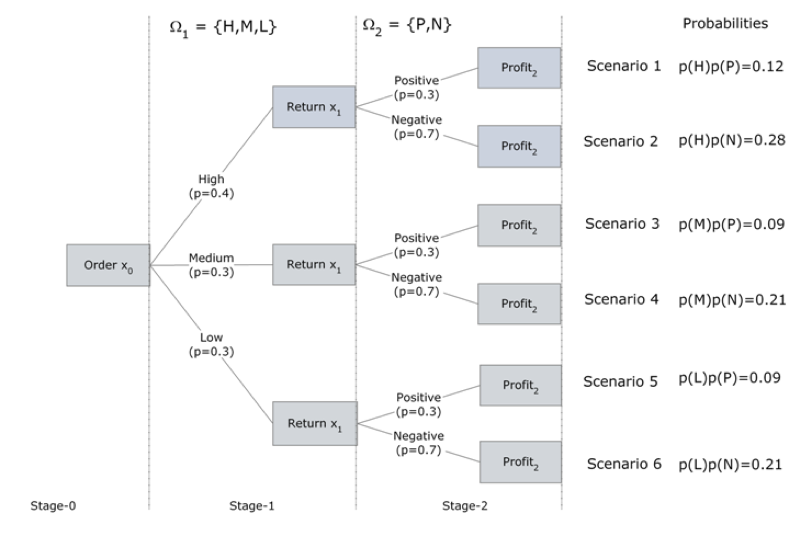
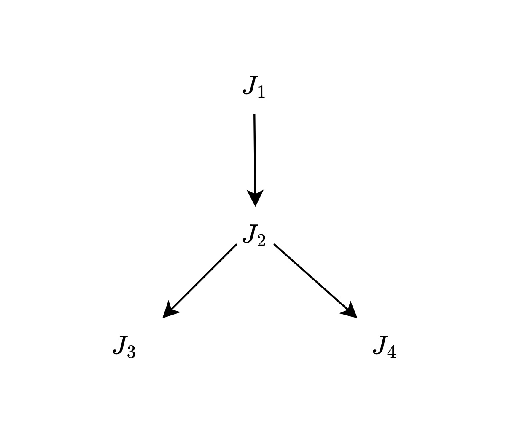

# Overview {.unnumbered}

This chapter is a collection of sequencing examples that are as close as possible to the CCDS, without all the details. The objecive is to prepare a library on which more realistic, and eventually forward-looking examples can be based. Our intention is not only to address today's scheduling problems, but also to prepare the ground for scheduling challenges of the next 5 to 10 years, where data and compute volumes will increase by several orders of magnitude---outstanding examples are [SKA](https://www.skao.int/en) and CERN's [FCC](https://home.cern/science/accelerators/future-circular-collider).

The chapter is divided into deterministic (D1 to D4) and stochastic (S1 to S3) scenarios.  Realistic cases are presented in the Use-Cases chapter.


## D1. Simplified Supply Chain Examples

Putting together:

- primal problem,
- dual problem,
- sensitivity analysis.

See [Example D1](examples/D1a_SC_simple.ipynb) and  [Example D1a](examples/D1b_SC_4_stage.ipynb)

These supply chain examples have the following structure.

```{mermaid}
graph LR
    A["Suppliers"] -->  B["Factories"] 
    B --> C["Warehouses"] 
    C --> D["Retailers"] 
```


```{mermaid}
%%{init: {'flowchart': {'curve': 'linear'}}}%%
flowchart LR
  subgraph SUP["Suppliers"]
    S1["$$S_1$$"]
    S2["$$S_2$$"]
    S3["$$S_3$$"]
  end
  subgraph FAC["Factories"]
    F1["$$F_1$$"]
    F2["$$F_2$$"]
    F3["$$F_3$$"]
  end
  subgraph WAR["Warehouses"]
    W1["$$W_1$$"]
    W2["$$W_2$$"]
    W3["$$W_3$$"]
  end
  subgraph RET["Retailers"]
    R1["$$R_1$$"]
    R2["$$R_2$$"]
    R3["$$R_3$$"]
  end

  S1 --> F1
  S1 --> F2
  S1 --> F3

  F1 --> W1
  F1 --> W2
  F1 --> W3

  W1 --> R1
  W1 --> R2 
  W1 --> R3

  style SUP fill:#EEEDFE,stroke:#AFA9EC,color:#3C3489
  style FAC fill:#E1F5EE,stroke:#5DCAA5,color:#085041
  style WAR fill:#FAEEDA,stroke:#EF9F27,color:#633806
  style RET fill:#FAECE7,stroke:#F0997B,color:#993C1D

  classDef purple fill:#EEEDFE,stroke:#AFA9EC,color:#3C3489
  classDef teal   fill:#E1F5EE,stroke:#5DCAA5,color:#085041
  classDef amber  fill:#FAEEDA,stroke:#EF9F27,color:#633806
  classDef coral  fill:#FAECE7,stroke:#F0997B,color:#993C1D

  class S1,S2,S3 purple
  class F1,F2,F3 teal
  class W1,W2,W3 amber
  class R1,R2,R3 coral
```

```{mermaid}
graph LR
    A["Instruments"] -->  B["HPC centres"] 
    B --> C["Data centres"] 
    C --> D["End-users"] 
```

Notice the perfect <mark>analogy with the CCDS</mark>. This enables easy transposition of supply chain examples to our contexts of interest.

## D2. Simplified Scheduling Examples

The scheduling [Example D2](examples/D2_sched-intro.ipynb) covers a lot of ground. We study a classical scheduling problem, where we are given a set of jobs, their release times, their durations and their due times. The objective is to optimize the makespan, or total duration of all the jobs. We also introduce the _total past due_, or lateness/tardiness as an additional objective.

We study:

- empirical scheduling (LIFO, EDD, SPT);
- key performance indicators (KPI);
- single-machine and multiple-machine scheduling;
- disjunctive scheduling using Big-M and convex hull approaches.


## D3. Simplified RCPSP Example

We are now in a position to add:

- resource constraints, and
- precedence relations described by a DAG 

to the scheduling problems above. This problem is known as the Resource Constrained Project Scheduling Problem, or RCPSP.

The optimization is now more complex, since the resource constraints have to be simultaneously satisfied while minimizing the makespan, or any function of the makespan, while satisfying all precedences described by the Directed Acyclic Graph of the complete workflow.

In  [Example D3](examples/D3_RCPSP.ipynb) we combine:

- resource constraints,
- precedence relations,
- time-indexed formulation,
- disjunctive approach.

The formulation is taken from Section @sec-math.


## D4. MRCPSP Examples

The final extension is to add multiple modes, or machines, for the execution of each task in the workflow. In other words, there is an additional choice to be made between, say, a fast but expensive machine, and a slower but cheaper one. This is the connection between the resource schedule and the supply chain viewpoint that best characterizes cross-facility workflows in the <mark>CCDS context</mark>.

In this example we have 4 jobs, 2 possible modes, 1 renewable resource and no non-renewable resources. Jobs 2 and 3 can be executed in mode 1 or in mode 2.

::: {#fig-mrcp}
```{mermaid}
graph LR
    A["$$J_0$$"] --> B("$$J_1$$")
    A --> C("$$J_2$$")
    B --> D("$$J_3$$")
    C --> E("$$J_4$$")
    D --> F["$$J_5$$"]
    E --> F

```
A project network represented as a directed acyclic graph (DAG) for a workflow with 4 processing jobs $J_1,\cdots, J_4.$ The tasks 0 and 5 are dummy tasks, representing the start and the end of the workflow.
:::

The project instance, shown above, is detailed in Table 1, where $S_j$ is the successor list of job $j,$ $m$ is the mode, $d_{jm}$ is the duration of job $j$ in mode $m,$ $k^{\rho}_{jm1}$ is the renewable resource requirement, $R^{\rho}$ is the renewable resource list, $K^{\rho}$ is the renewable resource limit, and $R^{\nu}$ is the non-renewable resource list, taken as empty. In other words we have 4 jobs, 2 possible modes, 1 renewable resource and no non-renewable resources. Jobs 2 and 3 can be executed in mode 1 or in mode 2. Jobs 0 and 5 are the source and sink respectively, with zero duration and zero resources.

$$\begin{aligned}
& \text {Table 1. Multi-mode RCPSP for a 4-job, 2-mode workflow. }\\
&\begin{array}{cccccccc}
%\begin{tabular}{|c|c|c|c|c|c|c|c|}
\hline 
j & S_{j}& m & d_{jm} & k^{\rho}_{jm1} & R^{\rho} & K^{\rho}_{1} & R^{\nu}\\
\hline 
0 & \left\{ 1,2\right\}  & 1 & 0 & 0 & \left\{ 1\right\}  & 3 & \emptyset \\
1 & \left\{ 3\right\}  & 1 & 2 & 2  &  &  & \\
2 & \left\{ 4\right\}  & 1 & 2 & 2 &  &  & \\
 &  & 2 & 3 & 1 &  &  & \\
3 & \left\{ 5\right\}  & 1 & 1 & 3 &  &  & \\
 &  & 2 & 2 & 1 &  &  & \\
4 & \left\{ 5\right\}  & 1 & 2 & 3 &  &  & \\
5 & \emptyset & 1 & 0 & 0 &  &  & \\
\hline 
%\end{tabular}
\end{array}
\end{aligned}$$

**Input File**

The simplest input file is a direct transcription of the table of variables.

```{.json}
{
  "0":{"suc":("1","2"),"mod":"A","drt":0,    "rsc":0},
  "1":{"suc":"3","mod":"A",      "drt":2,    "rsc":2},
  "2":{"suc":"4","mod":("A","B"),"drt":[2,3],"rsc":[2, 1]},
  "3":{"suc":"5","mod":("A","B"),"drt":[1,2],"rsc":[3, 1]},
  "4":{"suc":"5","mod":"A",      "drt":2,    "rsc":3},
  "5": {"suc":"","mod":"A",      "drt":0,    "rsc":0 }
}
```

```{.python}
import json

with open("input.json", "r") as jsonfile: 
    TASKS = json.load(jsonfile)
```

Though, for interoperability, we should privilege the data model format, described above in Section @sec-CDT. 


### MRCPSP Benchmark using CPLEX

In [Example I1](CPLEX-MRCPSP.qmd) of the Implementation section, we solve a 30-task example with 3 modes, 2 renewable resources and 2 non-renewable resources. This is certainly a bit beyond actual CCDS use-cases, but illustrates the capability of good optimization codes to address far more complex workflows with relative ease. 

### Simplfied MRCPSP Example

In [Example D4](examples/D4_MRCPSP.ipynb), we consider a scheduling problem with 5 tasks, 2 modes, 1 renewable resource, and 1 non-renewable resource. We use the time-indexed Pritsker formulation, and minimize the makespan. Note that we could consider a disjunctive (big-M) formulation, but since the problem size is small and easily solved, this is not necessary.

Here is the resulting schedule, in flowchart form.

```{mermaid}
flowchart LR
    S(((Start)))
    E(((End)))
    T1["Task 1<br/>m=2, d=6"]
    T2["Task 2<br/>m=2, d=2"]
    T3["Task 3<br/>m=2, d=5"]
    T4["Task 4<br/>m=2, d=2"]
    T5["Task 5<br/>m=1, d=2"]
    S --> T1
    S --> T2
    S --> T3
    T1 --> T4
    T2 --> T5
    T3 --> T5
    T4 --> E
    T5 --> E
```

---

---

## Stochastic Cases

Here we present a very complete range of pedagogical examples covering

1. Single-Stage cases, based on expectations with comparison of EVM, EVSS and EVPI.
2. Two-Stage cases, with recourse decisions.
3. Multi-Stage cases.

These examples are based on the excellent presentations of @PZGK2025book and its associated [website](https://mobook.github.io/MO-book/). We have tried to adapt these examples, as far as possible, to the <mark>CCDS context</mark>.

We recall the form of the objective function for each of the three cases.

- Single-stage:
  $$\min_x \mathbb{E}_z \left[ Q(x,z) \right],$$
where $x$ is the decision variable, and $z$ is a random variable.
- Two-stage:
  $$\min_x  c^{\top}x + \mathbb{E}_z \left[ Q(x,z) \right],$$
where $c$ is the deterministic cost.
- Multi-stage:
 $$\min_x  c^{\top}x + \sum_{i=1}^S \mathbb{E}_z \left[ Q(x_i,z) \right],$$
where $S$ is the number of scenarios.

## S0. Single-Stage Stochastic

Before embarking on two- and multi-stage cases, it is very instructive to study the context of a single stage, without a preceding deterministic stage as was presented in the theoretical section @sec-stoch. This context brings out the important concepts of the following scenarios: Expected Value for the Mean (EVM), Expected Value of the Stochastic Solution (EVSS), and Expected Value with Perfect Information (EVPI). Then, we can fully appreciate the importance of different stochastic models, and their comparison with deterministic ones.

The most basic way of accounting for randomness is to consider the average, or expected value, of a given uncertain quantity. For constraints, expectations are not useful, because protection against the average outcome generally produces a low level of protection. For that reason, we consider problems in which the expectation appears only in the _objective_, 
$$
 \min_x \mathbb{E}_z \left[ f(x,z) \right],$$ {#eq-stoch}
where $x$ is the decision variable, and $z$ is a random variable.

## S0a. Single-Stage Newsvendor Problem

The newsvendor problem is a cornerstone of stochastic optimization and can be applied to many different contexts. We suppose that a product (e.g. newspapers) can be purchased for a given cost, $c,$ but the sales at price $r$ depend on some uncertain demand $d_s,$ where $s$ is a possible scenario, and finally there may be a salvage value $w$ that is refunded for unsold items.

The problem is to determine how many items to purchase. The dilemma is that the scenario (say, weather) will not be known until after the order is placed. Ordering enough items to meet demand for a good scenario (weather)  results in a financial penalty on returned goods if the scenario (weather) is poor. On the other hand, ordering just enough items to satisfy demand on a poor scenario (weather)  leaves “money on the table” if the scenario (weather) is good.

In <mark>terms of the CCDS</mark>, we can reformulate the newsvendor as an optimal _inventory_ problem, where we need to allocate server/storage capacity $x$ to satisfy (uncertain) demand $d$ with three associated costs:

- allocation cost $c,$ 
- back penalty (shortage) cost $b,$ 
- holding (surplus) cost $h.$

The objective here is to minimize the total cost,
$$ G(x,d) = cx +b[d-x]_+ + h[x-d]_+
$$
where $[\cdot]_+ \doteq \max(\cdot\, , 0).$

Note, if $d$ is considered to be a random variable, then we obtain the objective of @eq-stoch.

First, we will consider a single-stage formulation, which will be generalized below to a two-stage case. 

In [Example S0a](examples/S0a_1stage_discrete.ipynb) we consider a discrete distribution for the sales (demand), which depends on three scenarios, each with an associated probability that has been estimated from past experience, or from archived (log) data. 


### S0b. Stock Optimization for a Distribution Center


This is another example of an inventory optimization (newsvendor) problem, where we want to buy an optimal quantity of stock, in this case servers or storage capacities, to cover an uncertain (future) demand.

In [Example S0b](examples/S0b_1stage_continuous.ipynb) we compare three different, _continuous_ distributions for the demand (sales). This problem has an explicit solution in terms of the given probability distribution functions. We compare this solution with a detreministic, average demand solution, and then with an SAA approximation of each distribution. This enables us to compute the VSS.

In <mark>terms of the CCDS</mark>, we could convert this to "Allocation Optimization for a Data or Compute Center".


## S1. Two-Stage Stochastic

Recall the formulation of the two-stage stochastic program (2SP),
$$
 \min_{\mathbf{x}}  \mathbf{c}^{\top} \mathbf{x} + \mathbb{E}_{\mathbf{\xi}} \left[ Q(\mathbf{x},\mathbf{\xi}) \right],
 \quad \mathbf{x} \in \mathcal{X},
$$
where 

- $\mathbf{c} \in \mathbb{R}^n$ is the first-stage cost vector,
- $\mathbf{x} \in \mathbb{R}^n$ is the first-stage decision vector,
- $\mathbf{\xi}$ is the vector of random parameters, following a probability distribution (discrete or continuous) $\mathbb{P}$ with support $\Xi,$
- the value function $Q \colon \mathcal{X} \times \Xi \rightarrow \mathbb{R}$ returns the cost of optimal second-stage (recourse) decisions under realization $\mathbf{\xi}$ given the first-stage decisions of $\mathbf{x}.$

In many cases, since $Q(\mathbf{x},\mathbf{\xi})$  is obtained by solving a MIP, evaluating the expected value function $\mathbb{E}_{\mathbf{\xi}} \left[ Q(\mathbf{x},\mathbf{\xi}) \right]$ is theoretically intractable, since it requires exhaustive (infinite) sampling. To obtain a more tractable formulation, the extensive form (EF) is used. We use a set of $S$ scenarios, $\mathbf{\xi}_1, \ldots, \mathbf{\xi}_S,$ sampled from the probability distribution $\mathbb{P},$ to obtain
$$
\mathrm{EF}(\mathbf{\xi}_1, \ldots, \mathbf{\xi}_S) = 
\min_{\mathbf{x}}  \mathbf{c}^{\top} \mathbf{x} + \sum_{s=1}^{S} p_s  Q(\mathbf{x},\mathbf{\xi}_s),  \quad \mathbf{x} \in \mathcal{X},
$$ 
where $p_s$ is the probability of scenario $\mathbf{\xi}_s$ being realized. If the recourse value function
$$
 Q(\mathbf{x},\mathbf{\xi}) = \min_{\mathbf{y}} F(\mathbf{y},\mathbf{\xi}), \quad \mathbf{y} \in \mathcal{Y},
$$
then $\mathrm{EF}(\mathbf{\xi}_1, \ldots, \mathbf{\xi}_S)$ can be written as a _deterministic_ optimization problem,
$$
  \min_{\mathbf{x},\mathbf{y}} 
  \mathbf{c}^{\top} \mathbf{x} + \sum_{s=1}^{S} p_s  F(\mathbf{y}_s,\mathbf{\xi}_s),  \quad \mathbf{x} \in \mathcal{X},
  \; \mathbf{y} \in \mathcal{Y(\mathbf{x},\mathbf{\xi}_s)}, \; \forall s=1,\ldots, S.
$$

The computational complexity of this problem grows linearly with the number of scenarios, which itself grows exponentially. As a result, the EF model is more challenging to solve when compared to a standard LP case, in particular at large scale. However, the cases encountered below in the examples, and in the CCDS, remain relatively small, and thus tractable.

### SAA

In  [Example S1a](examples/S1a_2stage_server_farm.ipynb) we use the statistical average approximation (SAA) to sample from continuous distributions in a 2-stage stochastic optimization for the design or allocation of computing resources. This is another example of an inventory optimization (newsvendor) problem, where we want to invest in an optimal number of resources, to cover an uncertain (future) demand.

### Scenario Tree

When the probability distributions for the random parameters (events) are discrete, there are only a
finite number of outcomes in each stage. With each random parameter fixed to one of its possible
outcomes, one can create a scenario representing one possible realization of the future. Enumeration of all possible combinations of outcomes allows us to represent all scenarios in a tree, with each scenario being a path from the root of the tree to one of its leaves. The nodes visited by each path correspond to values assumed by random parameters in the model. 

A simple, 2-stage case is studied in the second half of  [Example S1a](examples/S1a_2stage_server_farm.ipynb).


## S2. Multi-Stage Stochastic

We illustrate the construction of a multi-stage scenario tree with another stochastic version of the
Newsvendor inventory problem. In this case, we must decide how much to order initially and then
at a later time, how much of any unsold product to return before the end of the planning horizon. There is a shortage penalty when there are lost sales and a carrying cost for leftover (unsold) units. The decision process takes place under uncertain demand and uncertain price per returned item. This is a three-stage. problem.

1. In stage 0, the order quantity has to be decided (under uncertain demand).
2. In stage 1, at the beginning, the demand is revealed. A recourse decision, at the end of stage
1, is the number of units to be returned to the publisher (for an uncertain refund price).
3. In stage 2 at the beginning, the refund price is announced by the publisher. The price per
returned item can be either:
  -  Positive (i.e. publisher accepts them at a high price which covers the cost of shipping and handling) or
  - Negative (i.e. publisher accepts them at a low price which doesn’t cover the cost of shipping and handling).
4. The objective is to maximize the total expected profit at the end of planning horizon (stage 2).

::: {#fig-slp0}
{width=85%}

Scenario tree for 3-stage newsvendor problem, where the first stage has three scenarios (high with $p=0.4,$ medium with $p=0.3,$ low  with $p=0.3$ ) and the second stage has two (positive  with $p=0.3,$ negative  with $p=0.7$).
:::

### Multi-Stage for Genomics Workflow

We now consider a slightly simplified, but nonetheless realistic example of a genomics workflow. Suppose that we have four jobs to perform: 

- preprocessing ($J_1$), 
- alignment ($J_2$), 
- variant calling ($J_3$), and 
- annotation ($J_4$). 

These have the follwing DAG structure:

::: {#fig-slp1}
{width=35%}

DAG for 4-task genomics workflow.
:::

The descriptions of the jobs, their resulting datasets and the CPU times needed for processing are resumed in the [notebook](examples/S2_multi_stage_discrete.ipynb).

## S3. Risk Measures

As presented in the [Risk Measures](./th-stochastic.qmd#risk-measures) section, there are various ways to include risk in the cost function. In [Example S3](./examples/S3-OPF_risk.ipynb), we analyze a stochastic  energy dispatch problem, and compare the following risk measures:

- mean,
- CVaR,
- mean-variance,
- exponential.


