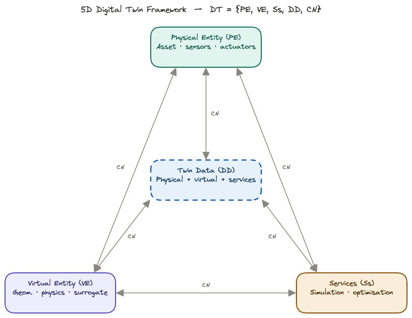
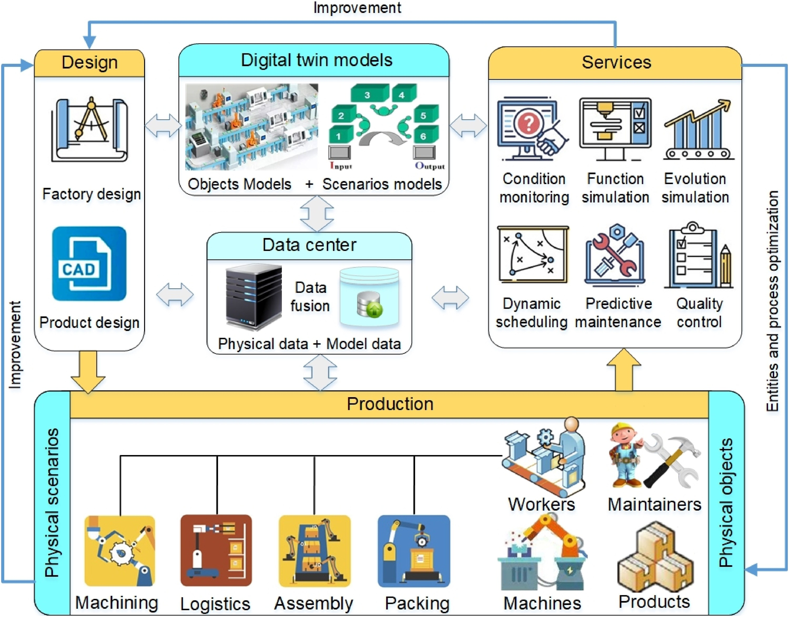
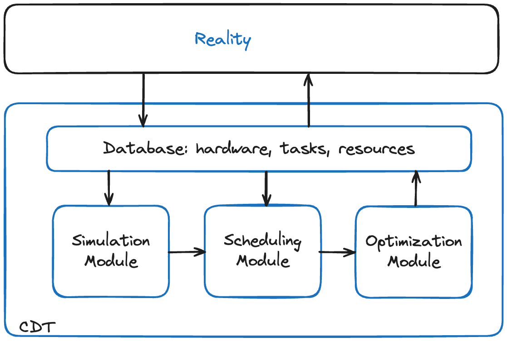

# Background and Setting {.unnumbered}

## Digital Models, Shadows and Twins

Before embarking on a model for the Digital Continuum and its Cross-Facility Workflows, we need to clarify some definitions related to Digital Twins. We cannot talk about digital twins without mentioning two other closely related concepts: digital models and digital shadows.

```{mermaid}
flowchart LR
  subgraph DM["① Digital Model"]
    direction TB
    PM("Physical <br> Entity")
    VM("Digital <br> Model")
    PM -. "manual only" .-> VM
  end
  subgraph DS["② Digital Shadow"]
    direction TB
    PS("Physical <br> Entity")
    VS("Digital <br> Shadow")
    PS -- "auto, one-way" --> VS
  end
  subgraph DTG["③ Digital Twin"]
    direction TB
    PT("Physical <br> Entity")
    VT("Digital <br> Twin")
    PT <-- "auto, bidirectional" --> VT
  end
  DM -- "automated <br> sensing (CN)" --> DS
  DS -- "feedback <br> & actuation (CN)" --> DTG
  classDef phy fill:#E1F5EE,stroke:#0F6E56,color:#085041
  classDef dig fill:#EEEDFE,stroke:#534AB7,color:#26215C
  classDef blc fill:white,stroke:#534AB7,color:#26215C
  class PM,PS,PT phy
  class VM,VS,VT dig
  class DM,DS,DTG blc

```

### Digital Models

A _digital model_ is a virtual representation of a physical object, system, or process. It can have
various forms, such as 3D models, computer-aided design (CAD) files, simulations, or
mathematical algorithms. Digital models enable the visualisation, analysis, and manipulation of
objects or systems in a digital environment, aiding in design, optimisation, and testing. Usually,
a model represents a prediction or guess as to how a physical object, system, or process might
operate in the future or in a particular environment.

For instance, an architectural firm might use a digital model to create a virtual walkthrough of a building design, allowing clients to visualise and make changes to the layout and aesthetics before any construction begins. The same goes for the Digital Continuum, where we can envisage a model that allows the simulation of a given workflow, across diverse facilities.

Digital models find applications across various industries and disciplines. They are mostly used
in architecture, engineering, manufacturing, and entertainment for design, prototyping, and
visualisation purposes. In scientific research, digital models are useful in simulations, data
analysis, and hypothesis testing.


### Digital Shadows

A _digital shadow_ is an evolving digital representation that mirrors the current state and
behaviour of a physical entity or system. It collects data from the asset (this could be a database,
a railway system, a banking platform, or a digital continuum) through sensors, Internet of Things (IoT) devices, or
other sources that provide a feed of information that is fed into the model. This means that a
digital shadow is up-to-date with the physical entity. It represents the asset to a sufficient level
of detail, so it is useful to gain a good understanding of it.

Typically, digital shadows are mathematical models, but they could also be 3D representations
and often focus on specific aspects (such as performance metrics, operational conditions, or
environmental factors). They enable monitoring, predictive analysis, and decision-making.

A manufacturing company might create a digital shadow of their production line. The digital shadow allows the
company to monitor and analyse production processes, identify bottlenecks, and make data-driven decisions for process optimisation and quality improvement. In case of any unexpected disruptions or data loss, the digital shadow can be used to restore the most recent operationaln state and minimise downtime.

Digital shadows are valuable in situations where monitoring and analysis are critical. They are
commonly employed in industries such as logistics, supply chain management, energy, and
transportation. By collecting and analysing data from sensors and IoT devices, digital shadows
facilitate predictive maintenance, anomaly detection, and optimisation of processes and
operations. 

We conclude that this is the concept most suited to our model of the Digital Continuum.

### Digital Twins

Digital _twins_ integrate the virtual and physical realms by creating a real-time connection
between the physical entity and its digital counterpart, where the physical object gives
information to the digital replica and vice versa. Digital twins simulate, monitor, and control
physical objects or systems, facilitating analysis, optimisation, and predictive maintenance.
They enable live feedback loops and foster insights for improving performance, efficiency, and
reliability.

There is a two-way interaction between the physical and the digital
environments, where the digital replica is able to change how the physical entity operates. For
instance, this is crucial if we are talking about a critical asset that is important in terms of the
value it is adding, in areas of national importance, such as safety, or competitive advantage. In
these cases, it is key to ensure that there is sufficient resilience when it comes to the ways in
which the asset will respond to potential deviations.

Digital twins are applicable in complex systems such as manufacturing plants, infrastructure,
healthcare facilities, and smart cities. They enable real-time monitoring and control, predictive
maintenance, and performance optimisation. Digital twins can also play an important role in
optimising energy consumption, enhancing product development, and enabling remote
monitoring and assistance. 

We could, at term evolve a digital shadow of the Continuum into a full digital twin, though this would imply that the digital twin be permitted to control the underlying compute, network and data infrastructures, probably by using adequate software (micro)services.

An important point to note, is that there is _no_ hierarchy between the three: models, shadows, and twins.  Rather,
it is better to look at a system that requires a digital representation in terms of decisional needs
and the types of desired value to make a decision on the solution that is required. Where is each
of them most suitable? Note also that there is a tendency to use the term ‘digital twin’ broadly to encompass any digital
representation that exhibits some form of virtual-physical integration. However, it is important
to distinguish between digital twins and other digital models or shadows to ensure clarity and
avoid diluting the concept’s significance.


### 5-D Framework for Digital Twins

Digital Twins (DT) can be modelled in five "dimensions" [@Qi2021] as 
$$
  M = \{ \mathrm{PE}, \mathrm{VM}, \mathrm{Ss},\mathrm{DD}, \mathrm{CN}\},$$

where $\mathrm{PE}$ are the physical entities, $\mathrm{VM}$ are virtual models, $\mathrm{Ss}$ are services,
$\mathrm{DD}$ are DT data, and $\mathrm{CN}$ are connections. 

::: {#fig-5D}
{width=100%}

5-D representation of a Digital Twin.
:::

To capture the full product lifecycle, the applications of a DT can be attached to the design, production and use phases, as shown below in @fig-5D-app 

::: {#fig-5D-app}
{width=100%}

Full life-cycle application of a Digital Twin in a industrial production setting.
:::

## Cross-Facility Workflows

A wide-scale, cross-facility workflow is a complex beast. It reunites users, jobs, and facilities, each with its resources and constraints. In the workflows that interest us, the facilites include data centres, HPC^[High Performance Computing] centres, and the network connections between these.

The basic problem can be resumed as follows: find an optimal schedule $S$ for a collection of jobs $J$ to be executed on a set of facilities $F,$ subject to constraints on resources, availability, precedences. The optimization can be performed for various objectives, or combinations of these, such as cost, project duration, facility availability, environmental impact. The presence of _uncertainty_ plays a central role and is included in the optimization process.

## The Exa-AtoW Project

This work is part of the Exa-AtoW project, a member of the NumPEx consortium.[ [https://numpex.org](https://numpex.org/) ]{.column-margin} The Exa-AToW project aims at providing solutions for the efficient management of large-scale workflows composed of HPDA, AI, and HPC tasks that are distributed over a continuum of resources ranging from the Exascale, HPC, and Data infrastructures.

Exa-AToW focuses on effective end-to-end solutions, at scale, by considering not only functional dimensions such as workflows and data logistics but also resource federation governance, cybersecurity, energy, and sustainability.

## CCDS: Cognitive Continuum Digital Shadow

Given the inherent complexity of Exascale workflows, they will inevitably be executed on a cross-facility infrastructure. Such a multi-component basis will inevtibaly be subject to uncertainties in availability, maintenance, cost, etc. In addition, the cybersecurity constraints will impose strict access conditions that make workflow testing basically impossible. And, more recently, the issue of sustainability and energy consumption by cyberinfrastructure [@IEA2025] is a critical issue, in particular for so-called hyperscalers and data centers used for AI training and inference. 

For all these reasons, the presence of a digital twin, or shadow, is indispensable for testing and planning workflow executions _before_ actually executing them. The computer science setup, based on micro-services and ontologies, is fully described in [@MGG2025implementation] and extended use-cases are presented in [@MGG2025usecases].


::: {#fig-modules}
```{mermaid}
graph LR
    A[SIM] --> B[SCD]
    B --> C[OPT]
    C --> A
```
Three core modules of the CCDS: simuulation (SIM), scheduling (SCD), optimization (OPT). An initial workflow definition enters at the left and an optimal workflow is produced. This core is embedded in a cognitive sodtware environment [@MGG2025implementation].
:::

The core of the CCDS is a set of three modules: simulation, scheduling and optimization, as shown in @fig-modules. 
They can be used independently, or be chained together. These three are fed by a shared database, based on a common ontology that contains descriptions of all the jobs to perform, resources available, constraints to be respected, and any objectives to be attained. This database is connected to, and communicates with the real world---see  @fig-global. This communication can take the form of a MADPP (machine actionable data project plan), a user-interface, or a combination of the two [@MGG2025implementation].

::: {#fig-global}
{width=80%}

Global software architecture of the CCDS core, consisting of three modules:
simulation (SIM), scheduling (SCD), optimization (OPT).
:::

All details can be found in [@MGG2025math].


## Uncertainty

 Deterministic schedules optimize for a world that, in theory, never materializes. Processing times vary, machines fail, networks are overloaded, demand shifts. As a result, a schedule that is "optimal" under perfect information often performs poorly when reality intervenes.  Stochastic formulations, on the other hand, explicitly hedge against variability. The resulting schedules may sacrifice some of the theoretical efficiency, but maintain feasibility when _disruptions_ occur, thus avoiding costly rescheduling or missed deadlines. Rather than a single makespan or cost figure, one can obtain distributions: "We meet the deadline with 95% confidence" which is far more informative than "the expected completion is Tuesday."

Hence, when uncertainty in job durations or data transfer arrivals is modeled, the true value of buffer capacity, parallel facilities, or overtime flexibility becomes visible. Deterministic models systematically undervalue these. We can compute the value of the stochastic solution (VSS), which quantifies what can be gained by solving the full stochastic program rather than just optimizing against average conditions. Note that averaging yields a deterministic problem.

The Value of Stochastic Solution (VSS) is defined as the difference between the Expectation of the Expected Value Solution (EEVS) and the optimal objective value of the Recourse Problem (RP). The VSS quantifies the benefit of using a stochastic model in place of a deterministic one in decision-making problems under uncertainty. A large VSS signals that the system is sensitive to variability, hedging decisions matter, and the deterministic approximation is potentially dangerous.

::: {.column-margin}
$$\mathrm{VSS} = \mathrm{EEV} - \mathrm{RP}$$
:::

In conclusion, when faced with expensive (financially and environmentally), time-consuming Exascale workflows, the need to consider uncertainty in the scheduling program is vital. Stochastic-based scheduling can take into account any uncertain resources and all uncertain costs---a good example would be variable energy costs. The solution thus obtained will permit a _hedging_ strategy. We can, in addition, perform risk analysis, where we compare alternative deployments of the workflow as a function of our _risk profile_.


