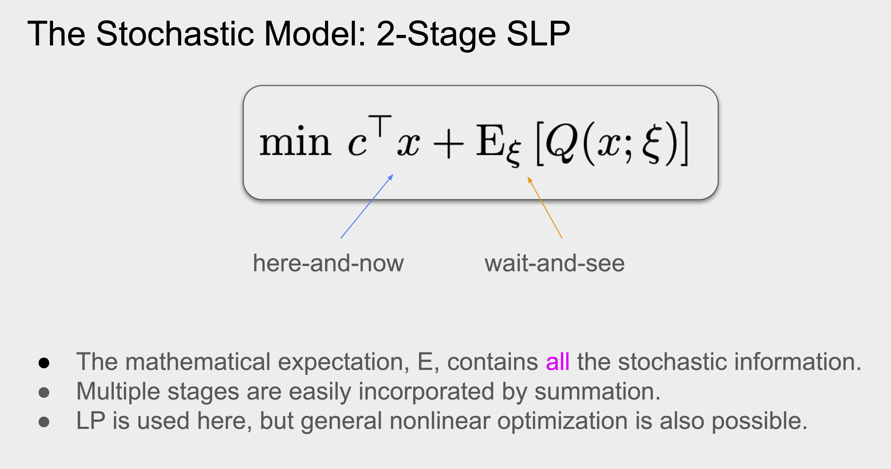
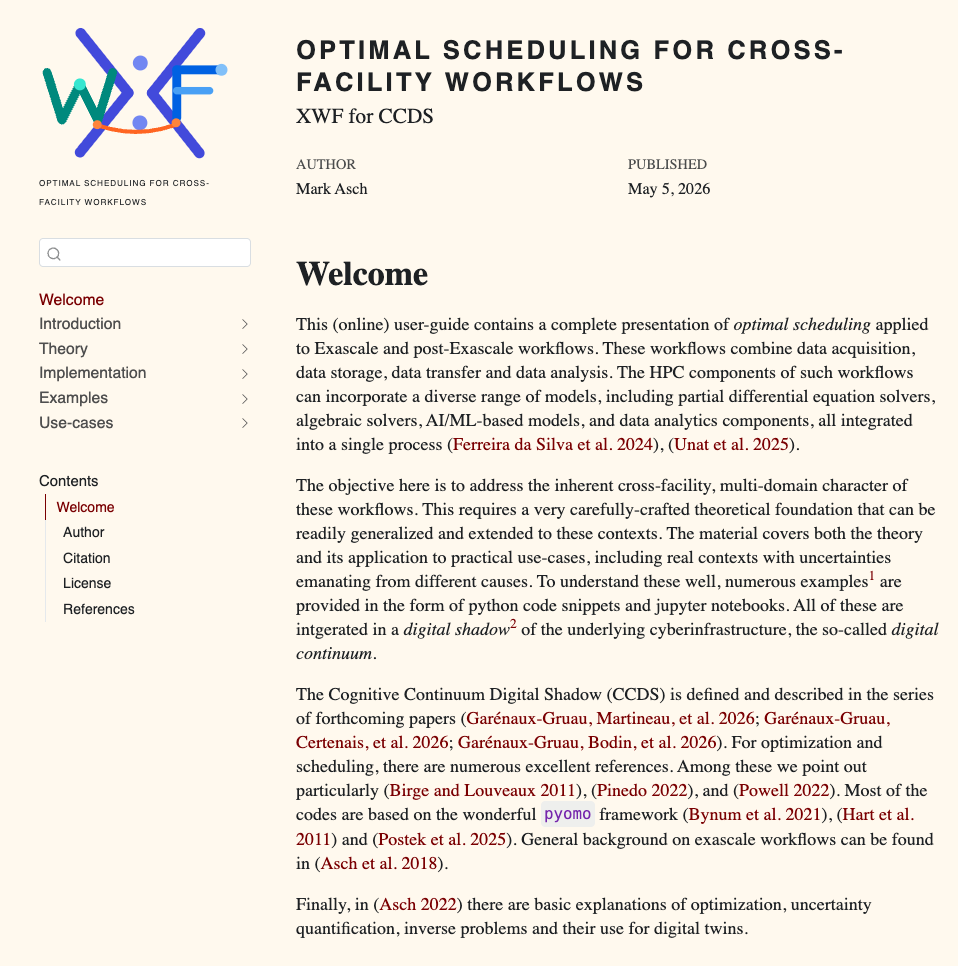

## Introduction

### Models, Shadows, & Twins

The digital continuum is a complex beast, composed of projects, facilites, jobs, limited resources (renewable and non-renewable).

A digital [**model**]{.ubdred} is a fixed representation of a system.

A digital [**shadow**]{.ubdred} is a dynamic reflection of a system.

A digital [**twin**]{.ubdred} exchanges two-way information with a system.

The [**CCDS**]{.ubdteal}^[Cognitive Continuum Digital Shadow] is a cognitive approach to investigate and monitor large-scale, cross-facility workflows.

## CCDS Roles

We can use the CCDS for

- monitoring,
- simulation,
- [**optimal**]{.ubdteal} planning and scheduling.

## Optimal Planning {.smaller}

 We want to find an [**optimal**]{.ubdteal} schedule for 
 
 - a collection of jobs,  
 - to be executed on a set of facilities, 
 - subject to constraints on resources, availability, precedences (DAG). 

The optimization can be performed for various  objectives, or combinations of these, such as  

- project duration (time is money),  
- cost (money is money), 
- facility availability,  
- environmental impact, etc.

::: callout-note
[**Uncertainty**]{.ubdred} plays a central role in the optimization process.
:::

# Mathematical Models {.transition-slide-ubdyellow}

## Which Models for What?

- state-space model for simulation
- optimal scheduling for planning
- energy monitoring and management

## LP Formulation: MRCPSP {.smaller}

:::: {.columns}

::: {.column width="68%"}

$$
\begin{align}
\min \quad &  \sum_{t=\mathrm{EF}_J}^{\mathrm{LF}_J} t\cdot x_{J1,t} + \text{other terms}\\
\text{s.t.} \quad & 
 \sum_{m=1}^{M_j}  \sum_{t=\mathrm{EF}_J}^{\mathrm{LF}_J} x_{jm,t}  = 1,  \,\,\, j=1,\ldots, J , \\
 & \sum_{m=1}^{M_j} \sum_{t=\mathrm{EF}_h}^{\mathrm{LF}_h} t \cdot x_{hm,t} \le \sum_{m=1}^{M_j}\sum_{t=\mathrm{EF}_j}^{\mathrm{LF}_j} (t - p_{jm}) \cdot x_{jm,t},  \,\,\, j=2,\ldots, J, \, h \in \mathcal{P}_j , \\
 & \sum_{j=2}^{J-1} \sum_{m=1}^{M_j} k_{jmr}^{\rho} \sum_{q=\max\{t,\mathrm{EF}_j\} }^{\min \{ t+p_{jm}-1,\mathrm{LF}_j \}}  x_{jm,q} \le K_r^{\rho}, \,\,\,  r\in R^{\rho}, \, t=1,\ldots, \bar{T}, \\
& \sum_{j=2}^{J-1} \sum_{m=1}^{M_j} k_{jmr}^{\nu}   \sum_{t=\mathrm{EF}_J}^{\mathrm{LF}_J}  x_{jm,t} \le K_r^{\nu}, \,\,\, r\in R^{\nu}, \\
& x_{jm,t}  \in \{0,1\}, \,\,\, j=1,\ldots,J, \, m=1,\ldots ,M_j, \, t =0,\ldots, \bar{T}, 
\end{align}
$$
:::

::: {.column width="32%"}

::: {.fragment .fade-in-then-out}
For every activity/job $j,$ in mode $m$ and for every feasible completion time $t \in [\mathrm{EF}_j, \mathrm{LF}_j],$
$$
  x_{jm,t} = \begin{cases} 1, \quad \text{job $j,$ mode $m,$ finish at $t,$} \\ 0, \quad  \text{otherwise.}  \end{cases} 
$$
for $j \in \mathscr{J},$ $m \in \mathcal{M},$ $t \in [\mathrm{EF}_j, \mathrm{LF}_j].$
:::

::: {.fragment .fade-in-then-out}
[[**Objective:**]{.ubdred} minimize makespan; can add any cost function of the duration.]{.absolute bottom="75%" left="70%"}
:::

::: {.fragment .fade-in-then-out}
[[**Constraint:**]{.ubdred} each activity is assigned exactly one mode and exactly one finish time.]{.absolute bottom="65%" left="70%"}
:::

::: {.fragment .fade-in-then-out}
[Ensure that no activity is started until all its predecessors are finished.]{.absolute bottom="55%" left="70%"}
:::

::: {.fragment .fade-in-then-out}
[Ensure that the per-period levels of the renewable resources are met.]{.absolute bottom="45%" left="70%"}
:::

::: {.fragment .fade-in-then-out}
[Consumption of the non-renewable resources is limited to their availabilities.]{.absolute bottom="35%" left="70%"}
:::

:::

:::: 

::: {.fragment .highlight-red}
Finally, restricting the summations over time to the intervals $[\mathrm{EF}_j, \mathrm{LF}_j]$ reduces drastically the number of variables and gives better convergence. These time windows can be computed by simple forward and backward recursion loops. This produces what is known as a _tighter_ formulation.
:::

## SLP Formulation: 2-Stage Recourse 

::: {#fig-sdp}
{width=80%}

Objective function for a two-stage decision process with uncertainty. The deterministic term is based on actual knowledge. Stochastic exogenous inputs $\xi$ become known afterwards. Recourse problem is solved for $Q(x;\xi).$
:::

# Summary {.transition-slide-ubdteal}

## Summary

We propose a complete toolbox for shadowing the Digital Continuum. Optimization is fully documented at 
[https://markasch.github.io/RCP4CDT/](https://markasch.github.io/RCP4CDT/)

{.absolute top="180" left="150" width="750" height="800"}

## TODO

Still to do in 2026-8:

- Use-Cases (Mathis, Marius, ...).
- Complete maquette of the CCDS  related to GENCI centers (Olivier, Gaël, Marius, ...).
- Publications (all).

