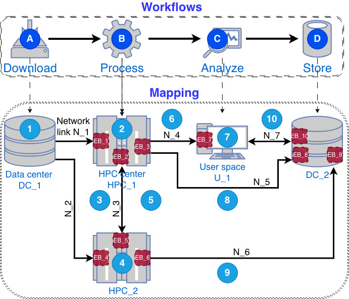
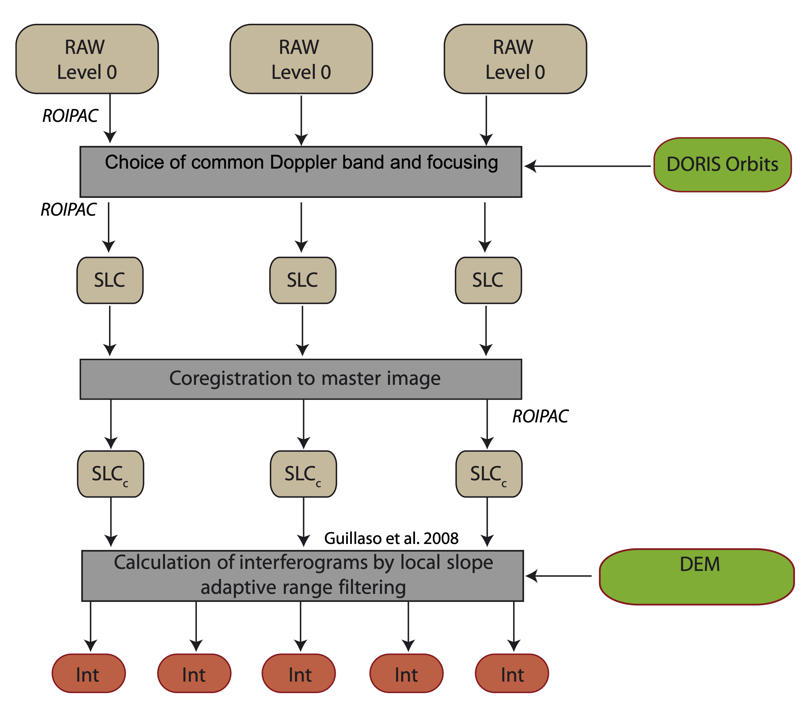

# Overview {.unnumbered}

The objective of the Exa-AtoW project is to produce operational workflows of exascale and post-exascale workflows. We ilustrate here the scheduling optimization of two full-scale use-cases, as implemented by the CDT: 

- DDFFACET
- NSBAS.

## DDFACET

The DDF Pipeline is a data processing tool initially designed for the LOw-Frequency ARray (LOFAR) radio telescope and is a candidate for processing SKA data. The workflow is quite simple, with choice of HPC centers, data centers and network connections. The batch size is large and so are the data volumes. For these reasons, optimal scheduling that takes into account facility availability and reliability, is very important.

{width=60% fig-align="center"}

Consult the [implementation](here). (COMING SOON)

## NSBAS

The detection of slow, time-dependent ground motion using the Interferometric Synthetic Aperture Radar (InSAR) technique requires the analysis and combination of multiple radar data takes over an extended time period. NSBAS is a workflow for InSAR data. The workflow, when broken down into all its components, is very complex. It includes numerous data acquisition stages from different sources---indicated in green. The workflow produces several outputs---shown in blue. In addition, there are numerous intermediate data products.

{width=60% fig-align="center"}

{width=60% fig-align="center"}

Consult the [implementation](here). (COMING SOON)
